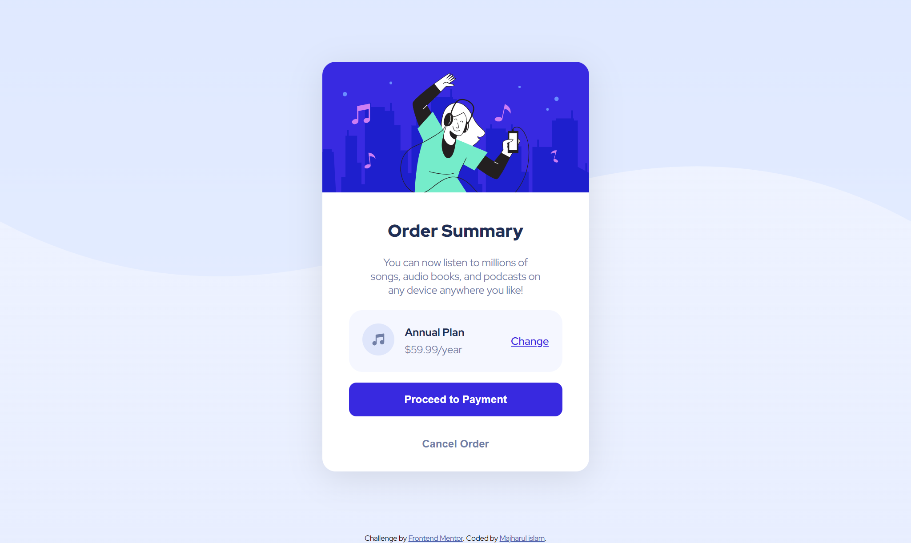
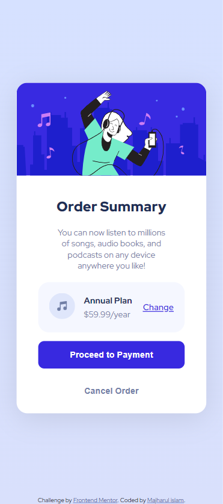

# Frontend Mentor - Order summary card solution

This is a solution to the [Order summary card challenge on Frontend Mentor](https://www.frontendmentor.io/challenges/order-summary-component-QlPmajDUj). Frontend Mentor challenges help you improve your coding skills by building realistic projects. 

### Links

- Solution URL: [Add solution URL here](https://github.com/Majharulislam1/frontendmentor_order_summary)
- Live Site URL: [Add live site URL here](https://majharulislam1.github.io/frontendmentor_order_summary/)

- [Author](#Majharulislam)

 
 

- See hover states for interactive elements

### Screenshot

 

